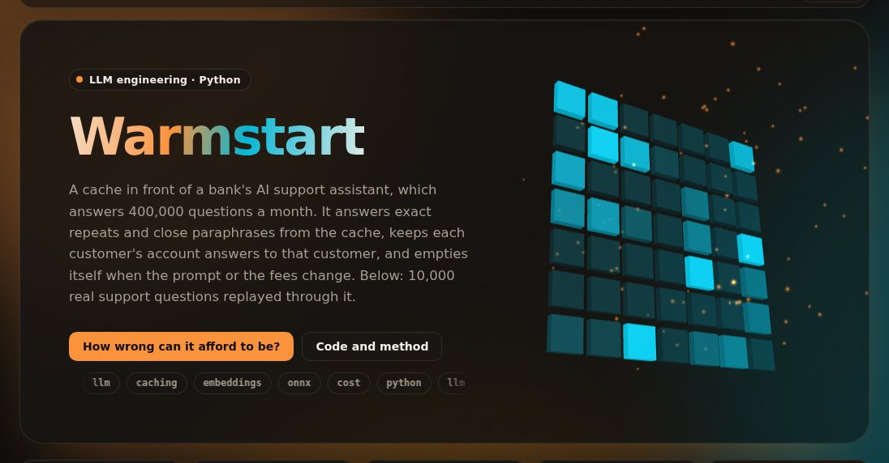

# Warmstart: a semantic cache for an LLM support assistant, measured

[](https://github.com/umer-78/warmstart/actions/workflows/ci.yml)

[](https://umer-78.github.io/warmstart/)

**Live dashboard:** https://umer-78.github.io/warmstart/ (hit rate through the day, the threshold
trade-off with a slider, every variant, and the wrong answers it served)

A bank's AI support assistant answers 400,000 questions a month, and most of them are the
same few questions worded differently. Warmstart answers exact repeats and close paraphrases
from a cache, keeps answers built from one customer's account away from every other customer,
and empties itself when the system prompt or the fee schedule changes. Replayed on 10,000
real support questions (18 hours of traffic), it answered **29.4%** from the cache,
served **4 wrong answers** (0.65% of paraphrase hits), leaked **nothing**, and cut the cost
per 1,000 questions from **$6.72 to $2.61** with the provider's prefix cache.

| | Hit rate | Wrong paraphrase hits | Leaked | Stale | $ per 1,000 questions | p50 | p95 |
|---|---|---|---|---|---|---|---|
| no cache | 0% | - | - | - | 6.72 | 1.59 s | 3.99 s |
| provider prefix cache only | 0% | - | - | - | 3.48 | 1.59 s | 3.99 s |
| exact layer only | 26.4% | - | 0 | 0 | 2.70 | 1.24 s | 3.67 s |
| **this cache** | **29.4%** | **4/616** | **0** | **0** | **2.61** | **1.19 s** | **3.63 s** |
| similarity floor, no agreement check | 30.5% | 5/793 | 0 | 0 | 2.57 | 1.16 s | 3.61 s |
| keyed on the question alone (the trap) | 69.0% | 13/1764 | **2,465** | **2,408** | 1.15 | 0.00 s | 2.86 s |

The hits, wrong answers, leaks and stale answers are measured. The dollars and seconds
multiply those by stated assumptions (see [Measured and assumed](#measured-and-assumed)).

## What it means

- **A semantic cache is a retrieval system with a precision problem.** On held-out
  questions, answering from the nearest cached paraphrase above a 0.96 similarity floor was
  wrong 2.8% of the time, and no floor got it under 1.6%. The errors sit on boundaries:
  "When will I get my card?" and "How soon will I get my card?" want different answers in
  Banking77, and so do "How do I reset my PIN?" and "How can I reset my PIN?". The fix is to
  serve a paraphrase only when every cached question close to it got the same answer. That
  cut wrong hits to 0.45% (6 of 1,346, 95% interval 0.20% to 0.97%) for 7.6 points of
  coverage.
- **Keying on the question alone is a data leak.** Nearly half the traffic asks about the
  customer's own card, payment or transfer. Keyed on the question alone, the cache served
  2,465 answers built from another customer's account, and 2,408 from an old prompt or old
  fees. The key here includes the model, temperature, tools, customer tier, system prompt
  version and scope, and the application marks which requests carry customer data.
- **Most of the saving is exact repeats and the provider's own cache.** The provider's
  prefix cache alone halves the bill, because the 1,200-token system block dominates each
  call. Exact repeats then answer 26.4% of questions; paraphrases add 3 more points. The
  semantic layer earns its place on the questions nobody types the same way twice, and it
  is the only layer that can serve a wrong answer, so its floor is set by how wrong the
  business can afford to be.
- **Threshold choice is a business decision.** The [dashboard](https://umer-78.github.io/warmstart/#threshold)
  shows the trade: at 0.90 with the agreement check, 69% of held-out questions are answered
  and 0.56% of those wrong; at 0.96, 44% and 0.45%.

| Embedder | Setting chosen on training questions | Held-out answered | Held-out wrong | Without the agreement check | Replay hit rate | ms per question |
|---|---|---|---|---|---|---|
| **bge-small-en-v1.5** | ≥ 0.96, 10 neighbours within 0.08 | 43.7% | 6/1346 (0.45%) | 44/1580 (2.8%) | 29.4% | 4.2 |
| all-MiniLM-L6-v2 | ≥ 0.95, 10 neighbours within 0.08 | 28.1% | 9/866 (1.0%) | 24/941 (2.6%) | 27.8% | 2.6 |
| TF-IDF (word and character n-grams) | none met the target | 1.8% | 2/55 | 2/55 | 26.4% | 16.1 |

**Recommendation:** ship bge-small with the agreement check at 0.96, behind the provider's
prefix cache. It keeps wrong answers under the 1% gate on both held-out questions and the
replay, and the near-miss log shows where to go next: 723 of the 729 questions that fell just
under the floor would have been answered right, the evidence a team would check with a judge
on its own traffic before lowering it.

## What went wrong on the way

- **The first replay made the cache look useless.** 2,000 questions spread over a week gave
  an 11% hit rate: at that rate an entry expired before its question came back. Real traffic
  at 400,000 a month arrives about nine times a minute, so the replay now uses that rate.
- **Tuning on the replay was tuning on noise.** A 2,000-question replay produced about 130
  paraphrase hits, so a 0.5% target meant "fewer than one wrong hit": the chosen floor gave
  2 to 5% on the test traffic. The floor and the agreement check are now chosen on thousands
  of question pairs from the training set (half as the cache, half as the traffic), then
  measured on the test set.
- **More witnesses was not worth it.** Requiring two cached questions above the floor before
  serving a paraphrase removed 72% of paraphrase hits for no measurable gain, so the option
  (`support=2`) exists but is off.
- **All four wrong answers in the replay are one question**, "How can I top-up my card?",
  asked four times. Banking77 labels it a top-up by cash or cheque; it got the answer about
  topping up by card, which is arguably right. It still counts as wrong: the labels are the
  only judge here.

## How it works

```
question ─► key (model, temperature, tools, tier, prompt digest, scope) ─► partition
           ├─ exact layer: same words after case, punctuation and spacing are ignored
           └─ semantic layer: nearest cached question ≥ 0.96, and every cached question
              within 0.08 of it got the same answer   ─► hit
           otherwise ─► the model, and the answer is stored with a TTL and tags
```

- **Scope** (`warmstart/cache.py`): an answer built from one customer's account is stored
  under `customer:<id>`, everything else under `shared`. The cache never guesses which is
  which; the application says so.
- **Expiry and invalidation:** account answers and questions about right now ("still",
  "pending", "today") live an hour, the rest a day. A new system prompt changes the key, so
  old entries are out of reach at once (0 served afterwards in the replay). A fee change
  retires every entry tagged `fees` (0 old fee answers served afterwards).
- **Embeddings** (`warmstart/embed.py`): bge-small-en-v1.5 through ONNX Runtime on the CPU,
  4 ms per question. MiniLM and a TF-IDF baseline for comparison.
- **The proxy** (`warmstart/proxy.py`): the OpenAI chat completions API, so an application
  switches by changing its base URL. It answers with `X-Cache: exact | semantic | miss |
  bypass`, streams misses through while keeping a copy, caches only responses that finished
  normally, and serves `/v1/cache/invalidate`, `/v1/cache/stats` and Prometheus `/metrics`.
  The application passes `X-Customer-Tier`, `X-Customer-Id`, `X-Cache-Scope` and
  `X-Cache-Tags`. Only single questions are cached; a follow-up depends on the conversation.

## Measured and assumed

- **Measured:** which questions the cache answered, whether each answer was written for the
  question's intent, for the same customer, under the current prompt and fees, and how long
  embedding and lookup took on one CPU.
- **Assumed** (`warmstart/support.py`): a frontier model at $3 and $15 per million input and
  output tokens, a 1,200-token system block that the provider's prefix cache bills at 10%,
  and replies taking 1.6 s at the median and 4 s at the 95th percentile.
- **Traffic** (`warmstart/replay.py`): Banking77's test questions, intents on a Zipf curve so
  the ten most common take about six in ten questions, from 500 customers on three tiers.
  Halfway through the system prompt changes; three quarters in, the fees do.

## Run it

```bash
pip install -e '.[dev]'
pytest -q                          # 14 unit tests, no downloads
python -m warmstart bench          # every table here (downloads Banking77 and two ONNX models, about 160 MB)
python -m warmstart gate           # the CI check: under 1% wrong, no leaks, no stale answers, hit rate held
python -m warmstart serve --upstream https://api.openai.com/v1
python -m warmstart demo           # rebuild the dashboard's data in docs/
```

## Limits

- Banking77's test set has about 40 wordings of each question, so over 10,000 questions
  customers repeat each other word for word more often than a real desk might. Read the
  exact layer's share as this dataset's, and the semantic layer's precision as the part
  that carries over.
- Questions about a customer's own account are never answered from another customer's
  entry, and they rarely repeat for the same customer, so they are mostly misses. Caching
  the shape of those answers and filling in the account data would be the next step; it is
  not built.
- In the replay, "same answer" is exact, because each simulated answer records what it was
  written for. The proxy compares real answers by their embeddings, which is looser; that
  comparison is not measured here.
- No judge model checked the hits: Banking77's intent labels are the judge, which makes the
  wrong-answer counts strict.

## Data and licences

- [Banking77](https://github.com/PolyAI-LDN/task-specific-datasets) (Casanueva et al., 2020),
  CC BY 4.0, pinned to a commit and checked against SHA-256.
- [bge-small-en-v1.5](https://huggingface.co/BAAI/bge-small-en-v1.5) (MIT) and
  [all-MiniLM-L6-v2](https://huggingface.co/sentence-transformers/all-MiniLM-L6-v2) (Apache 2.0),
  as the ONNX builds the fastembed library publishes, pinned by SHA-256.
- Nothing is redistributed here; everything downloads on first run. The code is MIT.
